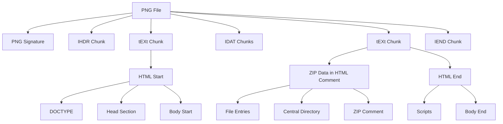

# How to Create HTML/ZIP/PNG Polyglot Files

This article is a summary of the presentation available [here](https://github.com/gildas-lormeau/Polyglot-HTML-ZIP-PNG). The resulting demo file can be downloaded at the end of the article.

## Introduction

[SingleFile](https://github.com/gildas-lormeau/SingleFile), a tool for web archiving, commonly stores web page resources as data URIs. However, this approach can be inefficient for large resources. A more elegant solution emerges through combining the ZIP format's flexible structure with HTML. We'll then take it a step further by encapsulating this entire structure within a PNG file.

## The Power of ZIP

The ZIP format provides an organized structure for storing multiple files. It is based on a structure with file entries followed by a central directory. The central directory acts as a table of contents, containing headers with metadata about each file entry. These headers include crucial information such as file names, sizes, checksums, and file entry offsets. What makes ZIP particularly versatile is its flexibility with data placement. The format enables data to be prepended before the ZIP content by setting an offset greater than 0 for the first file entry, while allowing up to 64KB of data to be appended afterward (i.e. ZIP comment). This feature makes it well-suited for creating polyglot files.

## Creating HTML/ZIP Polyglot Files

Based on this knowledge, we can create a self-extracting archive that works in web browsers. The page to be displayed and its resources are stored in a ZIP file. By storing the ZIP data in an HTML comment, we can create a self-extracting page that extracts and displays the contents of the ZIP file.

Here is the basic structure of the self-extracting page:
```html
<!doctype html>
<html>
  <head>
    <meta charset=utf-8>
    <title>Please wait...</title>
    <script> Content of lib/zip.min.js </script>
  </head>
  <body>
    <p>Please wait...</p>
    <!-- [ZIP data] -->
    <script> Content of assets/main.js </script>
  </body>
</html>
```

The `assets/main.js` script on this "bootstrap page" reads the ZIP data by calling `fetch(””)` and uses the `lib/zip.min.js` JavaScript library to extract it. This bootstrap page is then replaced by the extracted page with its resources. However, there's a problem: due to the same-origin policy, retrieving ZIP data directly with `fetch(””)` fails when the page is opened from the filesystem (except in Firefox).

## Reading ZIP Data from the DOM

To overcome the filesystem limitation, we can read ZIP data directly from the DOM. This approach requires careful handling of character encoding. The bootstrap page is now encoded in `windows-1252`, which allows data to be read from the DOM with minimum degradation. Some encoding challenges emerge:
1. DOM text content gets decoded to `UTF-16` instead of `windows-1252`
2. The `NULL` character (`U+0000`) gets decoded to the replacement character (`U+FFFD`)
3. Carriage returns (`\r`) and carriage return + line feeds (`\r\n`) get decoded to line feeds (`\n`)

The first 2 points can be fixed by using an association table to convert characters to `windows-1252`. For the last point, "consolidation data" in a JSON script tag is added in the bootstrap page. This data tracks the offsets of carriage returns and carriage return + line feeds, and enables accurate reconstruction of the original content when extracting the ZIP data.

Here is the resulting structure:
```html
<!doctype html>
<html>
  <head>
    <meta charset=windows-1252>
    <title>Please wait...</title>
    <script> Content of lib/zip.min.js </script>
  </head>
  <body>
    <p>Please wait...</p>
    <!-- [ZIP data] -->
    <script text=application/json>
    [consolidation data]
    </script>
    <script> Content of assets/main.js </script>
  </body>
</html>
```

## Adding PNG to the Mix

The PNG format consists of a signature followed by chunks. Each chunk contains these fieds:
- Length (4 bytes)
- Type identifier (4 bytes) e.g., `IHDR` (header), `IDAT` (data), `IEND` (end of file), `tEXt` (custom data)...
- Data content (n bytes)
- CRC32 checksum (4 bytes)

Here is the minimum structure of a PNG file:
1. PNG signature (8 bytes)
2. `IHDR` chunk (13 bytes)
3. One or more `IDAT` chunks
4. `IEND` chunk (12 bytes)

## The Final Form: HTML/ZIP/PNG Polyglot Files

The ultimate implementation combines all three formats into a single file. The HTML format's fault tolerance allows for this complex structure. However, this approach introduces new challenges:
1. The signature, the `IHDR` and the `IEND` chunks become visible as text nodes briefly and should be removed as soon as the page is parsed
2. The displayed page is rendered in quirks mode, requiring specific handling through `document.write()` and related methods to parse the displayed page

Here is the resulting structure viewed as PNG chunks:

```
[PNG signature]
[IHDR chunk]
[tEXt chunk
  <!doctype html>
  <html>
    <head>
      <meta charset=windows-1252>
      <title>Please wait...</title>
      <script> Content of lib/zip.min.js </script>
    </head>
    <body>
      <p>Please wait...</p>
      <!-- 
]
[IDAT chunk(s)]
[tEXt chunk
      -->
      <!-- [ZIP data] -->
      <script text=application/json>
      [consolidation data]
      </script>
      <script> Content of assets/main.js </script>
    </body>
  </html>
]
[IEND chunk]
```

Here is the diagram of the resulting structure:



## Optimization Through Image Reuse

The final optimization removes the main image (i.e. the logo of RennesJS) from the ZIP file and reuses the page, interpreted as a PNG file, to replace it in the displayed page.

## Resulting File
 
Download [demo.png.zip.html](https://github.com/gildas-lormeau/Polyglot-HTML-ZIP-PNG/raw/main/demo.png.zip.html) (a bug in "Archive Utility" on macOS prevents it from decompressing the resulting file, you can use unzip to get around this issue). Alternatively, you can also view the file [demo.png.zip.html](https://gildas-lormeau.github.io/Polyglot-HTML-ZIP-PNG/demo.png.zip.html).
